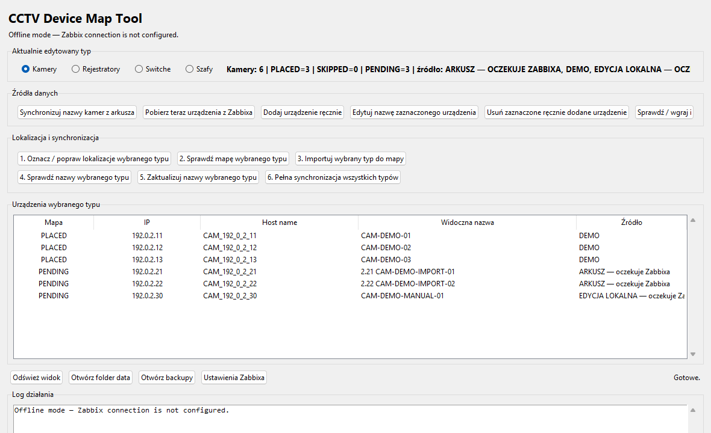
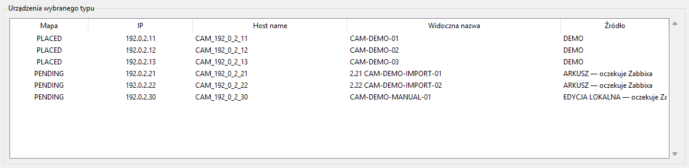
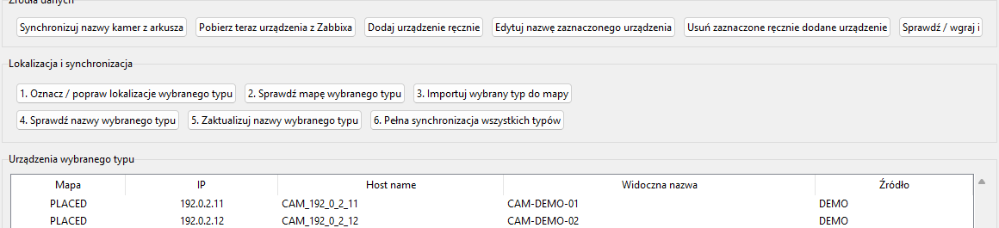
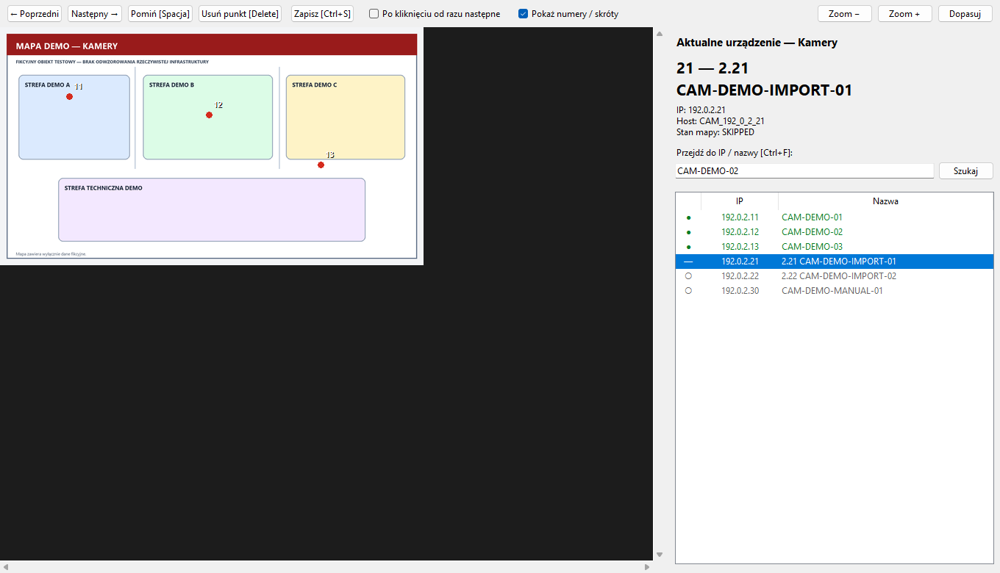

# CCTV Device Map Tool

CCTV Device Map Tool is a desktop application for managing CCTV-related devices and positioning them on existing Zabbix maps. It combines local device data, spreadsheet imports, map placement, change planning, and controlled synchronization in one workflow.



## Overview

Maintaining a large number of devices and map elements manually is time-consuming and prone to naming, placement, and data-entry errors. This tool provides a structured local device list and a visual editor, then prepares changes before applying them through the Zabbix API.

The included configuration starts in offline mode, so the interface and local workflow can be explored without a Zabbix server.

## Features

- Import from ODS, XLSX, XLS, and CSV files.
- Manage cameras, recorders, switches, and cabinet markers.
- Search devices by IP address, visible name, or technical host name.
- Maintain a local semicolon-delimited device list.
- Track map states with `PLACED`, `PENDING`, and `SKIPPED`.
- Position and update devices with a visual map editor.
- Integrate with the Zabbix JSON-RPC API when explicitly configured.
- Create and update Zabbix hosts.
- Update elements on existing Zabbix maps.
- Preview operations with dry-run before applying changes.
- Create backups and operation logs.



## How it works

```text
ODS / XLSX / XLS / CSV
          ↓
Local device list
          ↓
Map positions and PLACED / PENDING / SKIPPED states
          ↓
Dry-run and change plan
          ↓
Zabbix synchronization when explicitly configured
```



## Technology

- Python 3
- Tkinter / ttk
- Pillow
- Zabbix JSON-RPC API
- PowerShell
- ODS / XLSX / XLS / CSV
- JSON

## Screenshots

### Device list

The main table groups local devices by type and shows their map state, IP address, technical host name, visible name, and source.


### Map editor

The map editor supports searching, placing, skipping, and revisiting devices while preserving local coordinates and states.



### Synchronization controls

The synchronization section exposes the workflow for checking map changes, updating names, and running full synchronization after review.


## Running locally

Requirements:

- Python 3.10 or newer with Tkinter,
- Windows for the provided launcher and PowerShell synchronization helper.

Install the declared Python dependencies:

```text
py -m pip install -r requirements.txt
```

Start the application on Windows:

```text
run_windows.cmd
```

Alternatively:

```text
py app/cctv_device_manager.py
```

The application opens with fictional local data and neutral maps. A real Zabbix connection is not required to inspect the interface, device list, search, import, or map editor.

Run the built-in local validation with:

```text
py app/cctv_device_manager.py --self-test
```

## Privacy and public version

This public version:

- contains only fictional device names and sample records,
- uses IP ranges reserved for documentation,
- includes neutral maps that do not represent a real facility,
- contains no credentials or organization infrastructure data,
- leaves the real Zabbix connection unconfigured by default.

Local configuration, logs, backups, imported private spreadsheets, generated runtime data, and diagnostics are excluded through `.gitignore`.

## Background

The tool originates from a device-management and map-maintenance problem encountered during practical IT experience. This public version was prepared with neutral data and documentation, while preserving the original workflow and interface concepts.

Preparation and verification included AI assistance. This description does not claim sole authorship of any earlier internal solution.
